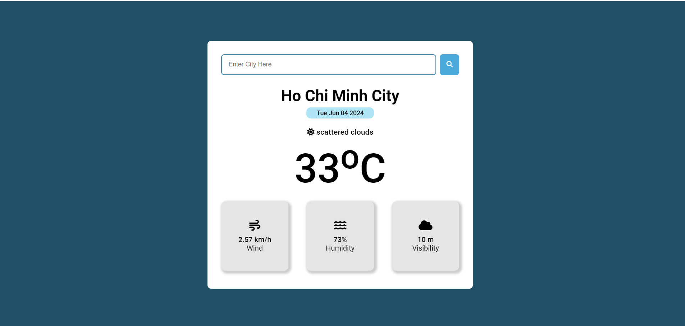

# Products website 
Create a web application that displays details of a possible location based on data from the API details.The website is built using HTML, CSS, JavaScript

## Installation
- Clone the repository and navigate to the project directory.

## Technologies
- HTML
- CSS
- JavaScript

## Screenshots
 
